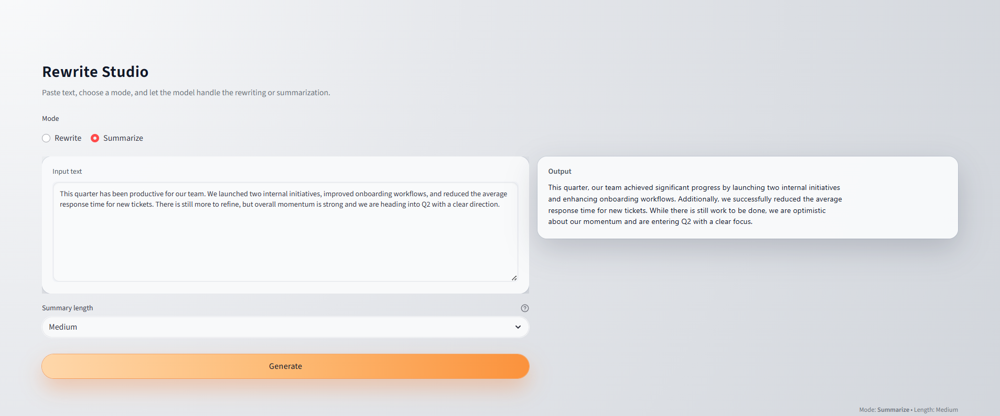

# Rewrite Studio

Small Streamlit app for rewriting and summarizing text with the OpenAI API.

The goal of this project is to show how I structure a simple AI feature:

- separate prompts, service layer, and UI
- keep API secrets in a local .env file
- present a clean, minimal interface

---

## Preview

---

## Tech Stack

- Python 3.10  
- Streamlit for UI rendering  
- OpenAI API for rewrite and summary generation  
- Modular service layer for clean separation of logic  
- Environment variables for API security

---

## Features

- Rewrite text into a target tone:
  - Friendly
  - Confident
  - Concise
  - Playful

- Summarize text into:
  - Short summary
  - Medium summary
  - Detailed summary

- Streamlit front end with a two column layout
- Uses the official OpenAI Python SDK

---

## Getting started

### Clone the repo

~~~bash
git clone https://github.com/Dhudson-AI/rewrite-studio.git
cd rewrite-studio
~~~

---

## Environment setup

Create a virtual environment:

~~~bash
python -m venv venv
~~~

Activate it on macOS or Linux:

~~~bash
source venv/bin/activate
~~~

Activate it on Windows:

~~~powershell
venv\Scripts\activate
~~~

Install dependencies:

~~~bash
pip install -r requirements.txt
~~~

Create your environment file:

~~~bash
cp .env.example .env
~~~

Add your OpenAI API key inside the new .env file.

---

## Running the app

~~~bash
streamlit run app.py
~~~

This opens Rewrite Studio in your browser.  
Paste text into the left column.  
Choose a tone or summary type.  
View the rewritten output on the right.

---

## Project structure

~~~text
rewrite-studio/
│
├── app.py
├── services/
│   ├── tone_rewriter.py
│   ├── summarizer.py
│   ├── client.py
├── ui/
│   ├── layout.py
│   ├── components.py
├── .env.example
├── requirements.txt
└── README.md
~~~

---

## Architecture

The project follows a simple separation of concerns.

- The ui folder handles layout and presentation
- The services folder contains prompt templates and API logic
- The client module manages model configuration and request handling

Tone rewriting uses structured prompts for clarity and consistency.  
Summaries use proportional compression to preserve important ideas.

---

## Why this project exists

Rewrite Studio demonstrates practical skills required for real AI powered features:

- Designing clear and controlled prompts  
- Organizing a small but complete codebase  
- Handling environment variables securely  
- Creating a minimal and functional UI  
- Writing code that can be extended without major rewrites  

---

## Future extensions

Possible improvements:

- Additional tone options  
- More summary modes  
- Export rewritten text as PDF or Markdown  
- History view for previous rewrites  
- Light authentication support  

---

## Requirements

- Python 3.10 or newer  
- Streamlit  
- OpenAI Python SDK  
- python-dotenv  

All dependencies are listed in requirements.txt.

---

## License

MIT License. You may use or modify this project with attribution.

---

## Contact

Created by Dillon Hudson  
GitHub profile: https://github.com/Dhudson-AI
